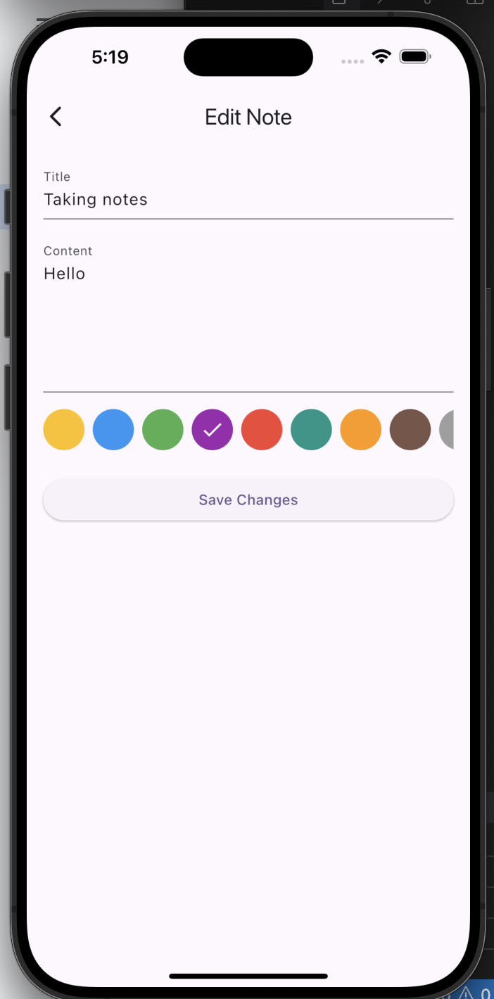

## Screenshots

| Login                | Product List         |
|----------------------|---------------------|
|  |  |

| Notes List           | Edit Note           |
|----------------------|---------------------|
|  |  |

# Flutter Clean Architecture App

A Flutter app built with GetX and clean architecture, featuring:
- Login with validation
- Product list with search/filter and REST API integration
- Note-taking with offline sync and local storage (SharedPreferences)

## Features

- **Login Screen:**  
  - Email & password validation (regex, password rules)
  - Show/hide password toggle
  - EasyLoading feedback
- **Product List:**  
  - Fetches from REST API
  - Search, filter, pull-to-refresh
  - Skeleton loader
- **Notes:**  
  - Create, edit, delete notes
  - Color tags
  - Offline sync (SharedPreferences)
- **Dark Mode:**  
  - Toggle in HomeScreen

## Tech Stack

- Flutter
- GetX (state management, navigation)
- SharedPreferences (local storage)
- REST API (mock/fake for products)
- EasyLoading (feedback)
- Clean Architecture

## Getting Started

### Prerequisites

- [Flutter SDK](https://flutter.dev/docs/get-started/install)
- Dart
- Android Studio / Xcode (for emulators)
- Git

### Clone the Repository

```bash
git clone https://github.com/salahuddinjony/task.git
cd task
```

### Install Dependencies

```bash
flutter pub get
```

### Run the App

#### On Android/iOS Emulator

```bash
flutter run
```

#### On a Specific Device

```bash
flutter devices
flutter run -d <device_id>
```

### Example Login Credentials

- **Email:** `user@example.com`
- **Password:** `Abcdef1`

## Publishing the App

### Play Store (Android)

1. **Update App Info:**  
   Edit `android/app/build.gradle` (version, applicationId, etc.)

2. **Generate Keystore:**  
   ```bash
   keytool -genkey -v -keystore ~/key.jks -keyalg RSA -keysize 2048 -validity 10000 -alias key
   ```

3. **Configure Signing:**  
   Update `android/key.properties` and `android/app/build.gradle` with keystore info.

4. **Build Release APK/AAB:**  
   ```bash
   flutter build apk --release
   # or for Play Store preferred format:
   flutter build appbundle --release
   ```

5. **Test Release Build:**  
   Install on device:  
   ```bash
   flutter install
   ```

6. **Upload to Play Console:**  
   - Go to [Google Play Console](https://play.google.com/console/)
   - Create a new app, fill in details, upload the `.aab` file
   - Complete content rating, privacy, and store listing
   - Submit for review

### App Store (iOS)

1. **Update App Info:**  
   Edit `ios/Runner.xcodeproj` (bundle identifier, version, etc.)

2. **Open in Xcode:**  
   ```bash
   open ios/Runner.xcworkspace
   ```

3. **Set up Signing & Capabilities:**  
   - Use your Apple Developer account
   - Set up provisioning profiles

4. **Build for Release:**  
   ```bash
   flutter build ios --release
   ```

5. **Archive and Upload:**  
   - In Xcode: Product > Archive
   - Use Xcode Organizer to upload to App Store Connect

6. **App Store Connect:**  
   - Fill in app info, screenshots, privacy, etc.
   - Submit for review

**More details:**  
- [Flutter: Build and release an Android app](https://docs.flutter.dev/deployment/android)
- [Flutter: Build and release an iOS app](https://docs.flutter.dev/deployment/ios)


## License

MIT

---

**For any issues, please open an issue or pull request on [GitHub](https://github.com/salahuddinjony/task).**


